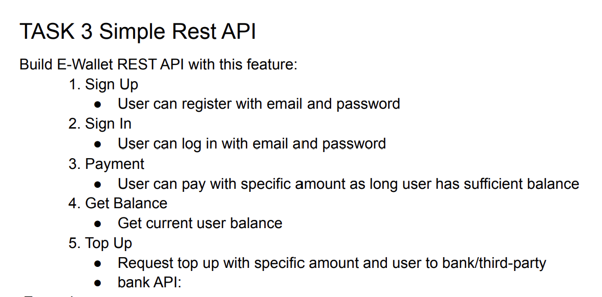

# E-Wallet
this is an simple REST API e-wallet

# Testing api with postman

```
import the file in Postman located at ./challenge.postman_collection.json
```

 # Requirements


# Tools used this project

1. Gin-gonic
2. Gorm
3. MySQL
4. JWT
5. godotenv
